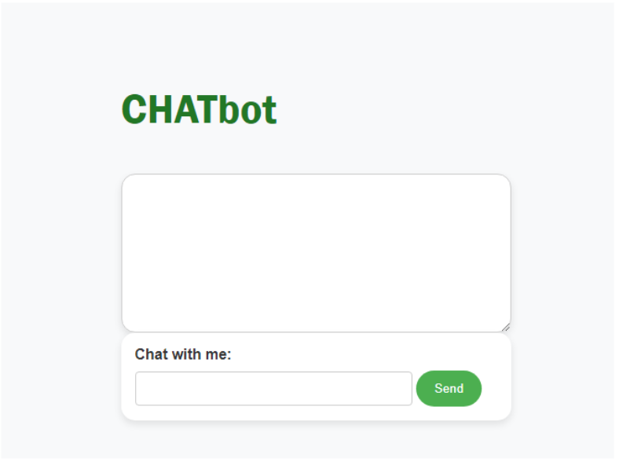

## AI Chatbot (JavaScript)

This repository contains an AI chatbot application built with JavaScript, LangChain, and Express. The chatbot features a front-end interface designed with HTML and CSS, and it is uniquely programmed to deliver exclusively sarcastic responses, mimicking human interaction for a hilariously sassy user experience.

## Features

Sarcastic AI chatbot powered by LangChain
Front-end interface built with HTML and CSS
Express.js server for handling API requests

## Prerequisites

Before running the application, ensure you have the following installed:
Node.js
npm (Node Package Manager)
OpenAI API key

Type your message in the input field and press Enter. The chatbot will respond with a sarcastic and witty reply.

